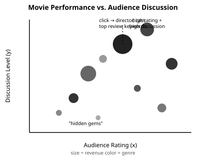
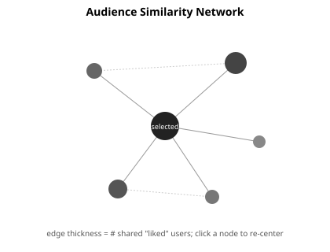
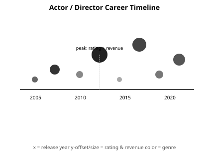
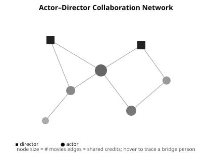
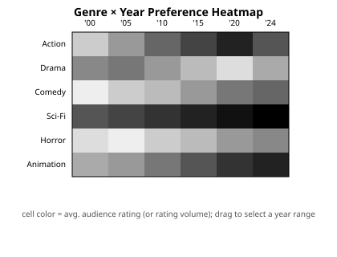

# The Movie Universe: Exploring Movies, People, and Audience Preferences

## 1. Topic, Goals, Audience, and Research Questions

Our project, **“The Movie Universe: Exploring Movies, People, and Audience Preferences,”** is an interactive data visualization website that helps users explore movies from three connected perspectives: movie characteristics, people and collaborations, and audience preferences. Instead of presenting information about a movie independently, the website will reveal relationships that are difficult to see from a single movie page.

The primary audience is **general movie audiences** who want to discover movies, understand why some movies receive strong audience responses, and explore connections between movies, actors, directors, and viewers. The website can help users find highly rated but less-discussed movies, discover movies that are liked by similar audiences, and explore how movie preferences have changed over time.

Our main research questions are:

1. **Audience Preferences:** What types and characteristics of movies tend to receive high audience ratings, and how do these preferences vary across genres and time?
2. **Audience Similarity:** If audiences highly rate one movie, what other movies do they tend to enjoy, and are these relationships associated with shared genres, keywords, actors, or directors?
3. **Popularity and Discussion:** How do movie ratings differ from audience attention or discussion, and what characteristics are associated with highly discussed movies?
4. **Audience Reviews:** What themes or characteristics do audiences frequently discuss in their reviews, and how are these discussions related to audience ratings?
5. **People and Collaboration:** How are actors’ and directors’ careers and collaborations associated with movie performance and audience reception?

Time will be used as a cross-cutting dimension to examine how genres, audience preferences, and movie performance change over time.

## 2. Datasets and Data Sources

We will use two main data sources: the **[TMDB API](https://developer.themoviedb.org/docs/getting-started)** and **[MovieLens 32M](https://grouplens.org/datasets/movielens/32m/)**. The TMDB API will provide movie and people metadata, while MovieLens will provide user-level movie ratings.

From TMDB, we will collect information such as movie title, release date, genres, vote average, vote count, popularity, budget, revenue, cast, crew, and director information. We will also use the [TMDB movie reviews endpoint](https://developer.themoviedb.org/reference/movie-reviews) to collect available audience review text, author information, and review dates. These reviews will allow us to analyze discussion topics and frequently mentioned keywords.

For audience preference analysis, we will use **MovieLens 32M**, which contains approximately 32 million ratings from about 201,000 users across approximately 87,000 movies. The dataset also includes movie information, tags, timestamps, and a `links.csv` file that connects MovieLens movies to external identifiers, including TMDB IDs. This mapping will allow us to connect user-rating behavior from MovieLens with movie and people information from TMDB.

We expect to work with a selected subset of approximately **500–1,000 movies**, with the final number determined after checking the overlap between MovieLens and TMDB and the availability of review data. MovieLens will mainly support historical audience-preference analysis, while TMDB will allow us to include more recent movies and current review information.

The raw data will be acquired and processed using Python. We will clean missing or inconsistent values, convert dates and numerical fields, join MovieLens and TMDB records through movie identifiers, and aggregate user ratings and review information for visualization. For review text, we will remove common stopwords and extract frequently occurring or informative keywords/themes. Because MovieLens has redistribution restrictions, we will carefully review its usage terms and avoid unnecessarily hosting the raw dataset on the final website. The website will primarily use processed or aggregated data.

## 3. Analysis and Visualization Methods

The project will use **D3.js, HTML, CSS, and JavaScript** for the interactive website and Python for data acquisition and preprocessing.

### Visualization 1: Movie Performance and Audience Discussion

We will create a **multivariate scatterplot** with audience rating on the x-axis and discussion level on the y-axis. Point size will represent revenue, while color will represent movie genre. Clicking a movie will display additional information, including its director, major actors, and the most frequently mentioned review keywords.

This visualization will help users identify patterns such as highly rated but less-discussed “hidden gems,” highly rated and highly discussed movies, and movies that receive substantial discussion despite lower ratings.

### Visualization 2: Audience Similarity Network

We will create a **movie-to-movie network** based on MovieLens user ratings. For example, users who give a movie a rating of 4 or higher can be considered to “like” that movie. Movies with many overlapping highly-rated users will receive stronger connections.

Users can select a movie and explore other movies preferred by similar audiences. We can then examine whether audience similarity corresponds to shared genres, keywords, actors, or directors.

### Visualization 3: Actor and Director Career Timeline

A **timeline visualization** will allow users to select an actor or director and explore their career over time. Each movie can be positioned by release year, with visual encodings such as rating, revenue, or genre.

This will help users examine how careers develop and whether periods of higher audience reception or commercial performance correspond to particular collaborations or genres.

### Visualization 4: Collaboration Network

A **force-directed network** will show relationships among actors, directors, and movies. Users will be able to explore recurring collaborations and identify people who connect different groups of movies.

This visualization will provide a structural view of the movie industry and allow users to investigate whether frequently collaborating actors and directors are associated with particular audience reception patterns.

### Visualization 5: Genre and Audience Preferences Over Time

A **heatmap** will represent genres across years, with cell values representing measures such as average audience rating, rating volume, or audience preference. Users will be able to filter the time period and compare different genres.

This visualization will show how audience preferences and the popularity of different movie types have changed over time.

The five visualizations will be connected through interactions such as filtering, highlighting, clicking, and linked selections. A movie selected in one visualization can provide additional context in another, creating a unified exploration experience rather than five independent charts.

## 4. Visualization Sketches

**1. Multivariate scatterplot — Movie Performance vs. Audience Discussion**

Positioning rating against discussion level (with size = revenue, color = genre) lets users spot highly rated "hidden gems" that receive little attention, directly addressing our popularity-vs-rating question.

**2. Node-link network — Audience Similarity**

Centering the graph on a user-selected movie and drawing edges by shared "liked" users lets viewers see at a glance which other movies attract the same audience, and whether that overlap tracks genre, cast, or director.

**3. Timeline — Actor/Director Career**

Plotting a person's movies by release year with rating/revenue encoded in size and offset reveals career trajectories and whether peaks coincide with specific collaborators or genres.

**4. Force-directed graph — Collaboration Network**

Distinguishing actors and directors as different node shapes and linking them by shared credits exposes the people who bridge otherwise separate groups of movies, supporting our people-and-collaboration question.

**5. Heatmap — Genre × Year Audience Preference**

Encoding average rating (or rating volume) as cell color across genre rows and year columns makes long-term shifts in audience taste easy to compare and filter.

These are rough digital mockups, not final designs; exact layout, color scale, and interaction details will be refined once we have processed data. The design will follow the principle that **position should represent the most important quantitative variables**, while size, color, and interaction provide additional dimensions without overcrowding the visualization.

## 5. Group Roles

**Jiaxuan – Data Acquisition and Processing:** Collect TMDB API data and MovieLens data, clean and transform datasets, create the movie/people/ratings/review datasets, and document data sources and processing steps.

**Muyu – Visualization and Interaction:** Implement D3.js visualizations, visual encodings, filtering, highlighting, tooltips, and linked interactions.

**Shared Responsibilities:** Both members will work on HTML/CSS website design, integration of the five visualizations, navigation, responsive layout, usability testing, debugging, documentation, and the final presentation.

## 6. Interim Presentation

For the interim presentation, we will present our research questions, data sources, data-processing pipeline, initial sketches, and early prototypes of the main visualizations. We will also demonstrate how the datasets can be connected and explain the planned user interactions.

## 7. Timeline and Milestones

| Week       | Tasks                                                                                            | Milestone / Output                        |
| ---------- | ------------------------------------------------------------------------------------------------ | ----------------------------------------- |
| **Week 2** | Finalize research questions, data sources, movie scope, and data schema                          | Final project plan and data specification |
| **Week 3** | Collect TMDB and MovieLens data; clean and join datasets; prepare visualization sketches         | Processed datasets and initial sketches   |
| **Week 4** | Implement scatterplot, audience similarity network, and career timeline                          | Three working visualizations              |
| **Week 5** | Implement collaboration network and genre/time visualization; add review keyword analysis        | Five core visualizations                  |
| **Week 6** | Integrate visualizations into one website; add filtering and linked interactions; improve layout | Interactive website prototype             |
| **Week 7** | Test, debug, improve usability and responsiveness, finalize documentation and presentation       | Final website and presentation            |

Our final goal is to create an interactive **movie exploration experience** in which users can move from a movie’s performance to audience preferences, reviews, people, collaborations, and changes over time. By combining these perspectives, the project aims to show not only **which movies perform well**, but also **how movies are connected to the people who make them and the audiences who watch them**.
