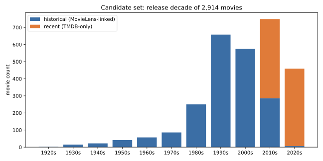

# Data Pipeline

## Layout

- `data/raw/` — untouched downloads (gitignored, regenerate via steps below)
- `data/processed/` — cleaned/merged/scored outputs, committed to git so teammates don't need to rerun the whole pipeline (needs MovieLens download + a TMDB key + a GPU for the sentiment step) just to get the data. Regenerate by running the scripts below in order if you need to. One exception: `ratings_candidates.csv` (876MB, MovieLens ratings filtered to the candidate movies) is gitignored — it's over GitHub's 100MB per-file limit, so it can't be pushed. Regenerate it with `src/clean_movielens.py`, or get it directly from a teammate.

## `data/processed/` file reference

**Use these for visualizations** — the final, merged tables:

| file | rows | columns | what it is |
|---|---|---|---|
| `movies_final.jsonl` | 2,914 | `tmdbId, movieId, imdbId, title, release_date, year, genres[], vote_average, vote_count, popularity, budget, revenue, runtime, overview, source, rating_count, rating_mean, rating_std` | One row per candidate movie, historical + recent tracks merged. `source` is `"historical"` (has real MovieLens rating data — `movieId`/`rating_count`/`rating_mean`/`rating_std` filled in) or `"recent"` (those columns are null). `budget`/`revenue` are null-clipped to `(0, 3e9]` — see the TMDB section below. |
| `cast_final.csv` | 28,991 | `tmdbId, person_id, name, character, order` | Top-10 billed cast per movie (by TMDB's own `order`). |
| `directors_final.csv` | 3,173 | `tmdbId, person_id, name, job` | Director credit(s) per movie (`job` is always `"Director"`; kept for consistency with `cast_final.csv`'s shape). |
| `keywords_final.csv` | 47,201 | `tmdbId, keyword` | TMDB's own tagged keywords per movie (not derived from reviews — see `review_keywords.jsonl` for that). |
| `reviews_sentiment.csv` | 11,481 | `tmdbId, author, content, created_at, author_rating, sentiment_label, sentiment_score` | Every cleaned/deduplicated TMDB review, one row each, with its sentiment score. `author_rating` is the reviewer's own 1–10 TMDB score if they left one (often null — most reviewers don't). |
| `review_sentiment_summary.csv` | 2,648 | `tmdbId, review_count, pct_positive, avg_sentiment_score` | `reviews_sentiment.csv` aggregated to one row per movie. Only movies with ≥1 review appear — absence means no review data, not zero/neutral sentiment. |
| `review_keywords.jsonl` | 2,648 | `tmdbId, keywords[]` | Top 8 TF-IDF terms (unigrams/bigrams) extracted from that movie's own reviews — themes audiences actually wrote about, different from TMDB's `keywords_final.csv`. |

**Intermediate files** — per-track or per-stage outputs, kept mainly so each pipeline stage is inspectable/debuggable on its own; the `_final` files above already fold these together:

| file | source | notes |
|---|---|---|
| `movies_clean.jsonl`, `links_clean.csv` | `clean_movielens.py` | All 87,585 MovieLens movies (not just candidates), cleaned. `links_clean.csv`: `movieId, imdbId, tmdbId`. |
| `candidate_movies.csv` | `clean_movielens.py` | The 2,000 historical-track movies selected by MovieLens rating count, before TMDB metadata is joined on. |
| `tags_candidates.csv` | `clean_movielens.py` | MovieLens user tags (`userId, movieId, tag, timestamp`), filtered to candidate movies. Not currently consumed downstream — kept in case a visualization wants free-text user tags alongside/instead of TMDB keywords. |
| `ratings_candidates.csv` | `clean_movielens.py` | **Gitignored, not in git** — see above. `userId, movieId, rating, timestamp`; every individual MovieLens rating for the historical-track movies. This is the raw material for co-rating overlap (Visualization 2's audience-similarity network). |
| `tmdb_movies.jsonl`, `tmdb_cast.csv`, `tmdb_directors.csv`, `tmdb_keywords.csv`, `tmdb_reviews.csv` | `fetch_tmdb.py` | Historical-track TMDB pull only, same schemas as the `_final` files. |
| `tmdb_movies_recent.jsonl`, `tmdb_cast_recent.csv`, `tmdb_directors_recent.csv`, `tmdb_keywords_recent.csv`, `tmdb_reviews_recent.csv` | `fetch_tmdb_recent.py` | Recent-track TMDB pull only, before dedup against the historical track. |
| `reviews_final.csv` | `merge_candidates.py` | Historical + recent reviews merged, *before* cleaning/sentiment scoring — `analyze_reviews.py` reads this and produces `reviews_sentiment.csv`. |
| `tmdb_missing_ids.json` | `fetch_tmdb.py` / `fetch_tmdb_recent.py` | tmdbIds that returned 404 (stale/removed TMDB entries) and got skipped. |

## MovieLens 32M

Download: https://grouplens.org/datasets/movielens/32m/ (direct: https://files.grouplens.org/datasets/movielens/ml-32m.zip)

```
curl -L -o data/raw/ml-32m.zip https://files.grouplens.org/datasets/movielens/ml-32m.zip
unzip data/raw/ml-32m.zip -d data/raw/
```

Verify against `data/raw/ml-32m/checksums.txt` (md5) before cleaning.

Run cleaning:

```
python src/clean_movielens.py
```

`src/clean_movielens.py` does the following:

- **movies**: extracts release `year` from the title, keeps a `clean_title` without the trailing `(YYYY)`, and splits the pipe-delimited `genres` string into a list (`(no genres listed)` becomes `[]`). Written to `movies_clean.jsonl` (list-valued `genres` doesn't round-trip cleanly through CSV).
- **links**: keeps `imdbId` as a zero-padded 7-digit string (leading zeros are significant and get silently dropped if read as a number) and `tmdbId` as a nullable integer.
- **ratings**: drops rows with a rating outside `[0.5, 5.0]` or not on the 0.5-step scale, drops duplicate `(userId, movieId)` pairs, and converts the unix timestamp to a datetime.
- **tags**: strips whitespace, drops empty/null tags, converts the unix timestamp to a datetime.
- **candidate selection**: joins movies to their rating counts, keeps only movies with a mapped `tmdbId` (needed to join TMDB metadata later) and at least 50 ratings, then takes the top `N_CANDIDATES` (currently 2,000) by rating count. Ratings and tags are then filtered down to just those candidate movies (`ratings_candidates.csv`, `tags_candidates.csv`) — the full 32M-row ratings table isn't needed once the movie subset is fixed.

This candidate list (`candidate_movies.csv`) is a starting point, not final — the final site should narrow back down per the proposal's 500–1,000-movie target once visualizations are built; 2,000 is a working superset, not the final scope, and a node-link diagram (Visualizations 2 and 4) with 2,000 nodes will need its own filtering/aggregation to stay legible.

**Caveats:**
- MovieLens 32M's ratings stop at **2023-10-12** (see `data/raw/ml-32m/README.txt`). A movie released after that date has ~zero MovieLens ratings, so selecting candidates by MovieLens rating count silently excludes everything recent — see the "two tracks" note below.
- The historical track is heavily skewed toward the 1990s–2000s (MovieLens' user base rated movies from that era the most) and thins out fast after 2015. The recent track (below) fills in 2016 onward — see `data/figures/historical_year_distribution.svg` (regenerate with `python src/plot_year_distribution.py`):

  

## TMDB

Needs an API key from https://www.themoviedb.org/settings/api, put in a local `.env` (gitignored) as `TMDB_API_KEY=...`. `src/tmdb_common.py` holds the shared fetch/cache/retry logic (`GET /movie/{id}?append_to_response=credits,keywords,reviews`, cached to `data/raw/tmdb/{id}.json`).

### Two tracks

Because MovieLens can't see anything released after 2023-10-12, and its own rating-count-based selection thins out even before that (few ratings had accumulated yet for 2016–2019 releases by the 2023-10 snapshot), movies are pulled in two tracks and tagged by `source`:

- **historical** (`src/fetch_tmdb.py`, ~2,000 movies) — TMDB metadata for the MovieLens-selected candidates above. These are the only movies with real MovieLens user-rating data, so they're the only ones usable for the audience-similarity network (Visualization 2).
- **recent** (`src/fetch_tmdb_recent.py`, ~900–1,000 movies) — movies released since `START_DATE` (2016-01-01), discovered directly via TMDB `/discover/movie` (sorted by `vote_count.desc`, not `popularity.desc` — TMDB's popularity score is recomputed continuously, so paginating by it mid-fetch causes movies to drift between pages and produces duplicates/gaps), taking the top `vote_count.gte` threshold in `VOTE_COUNT_THRESHOLDS` that yields at least `TARGET_MIN` movies. These have no MovieLens rating data, so they only feed the visualizations that don't need it (scatterplot, timeline, collaboration network, genre heatmap). The recent window overlaps the historical track's tail (both can have a 2018 movie, say); `merge_candidates.py` drops the recent copy of any `tmdbId` already present in historical, since the historical copy carries MovieLens ratings the recent one doesn't.

  Note the tradeoff behind `TARGET_MIN`/`TARGET_MAX`: selection is "top N by vote_count" over the whole window, and older movies in that window have had more time to accumulate votes, so widening `START_DATE` without also raising the target count skews the result toward the older end and thins out the newest months further (they haven't had time to accumulate 200+ votes yet either way — same underlying effect as the MovieLens cutoff, just on a shorter timescale).

Run both, then merge:

```
python src/fetch_tmdb.py
python src/fetch_tmdb_recent.py
python src/merge_candidates.py
```

`src/merge_candidates.py` concatenates both tracks into `movies_final.jsonl` / `cast_final.csv` / `directors_final.csv` / `keywords_final.csv` / `reviews_final.csv`, and null-clips `budget`/`revenue` outside `(0, 3e9]` — TMDB's budget/revenue fields are crowd-edited and very recent/upcoming releases sometimes carry vandalized placeholder numbers (e.g. one 2026 release showed a $2.45B revenue on a 2,746-vote page, implausible for a film that new). The `(0, 3e9]` bound catches obviously-fake and "unset" (0) values but isn't a full fact-check — spot-check before trusting `budget`/`revenue` for very recent titles.

## Review sentiment and keywords

```
python src/analyze_reviews.py
```

Reads `reviews_final.csv`, strips HTML/URLs, drops anything under 20 characters, and drops exact-duplicate review text. Sentiment is scored with `siebert/sentiment-roberta-large-english` (binary POSITIVE/NEGATIVE, 512-token limit, batched on GPU if available via `torch.cuda`). This was picked over a Twitter-tuned model or `distilbert-base-uncased-finetuned-sst-2-english`: our reviews run 170 words at the median (479 at the 90th percentile) — far past what a tweet-tuned model's ~128-token limit handles, and past what SST-2 was trained on too (SST-2 is short single-sentence/phrase snippets from critic pull-quotes, not full multi-paragraph audience reviews). siebert's training mix includes IMDB's full-length reviews, closer to what we actually have.

Keywords per movie come from TF-IDF (unigrams + bigrams, English stopwords removed, `min_df=3`) fit across all cleaned reviews, then the top 8 terms by summed TF-IDF weight within each movie's own reviews.

Outputs: `reviews_sentiment.csv` (per-review label/score), `review_sentiment_summary.csv` (per-movie review count, % positive, avg score), `review_keywords.jsonl` (per-movie top keywords). Coverage note: only ~2,650 of the ~2,900 candidate movies have any TMDB reviews at all — the rest get no sentiment/keyword data (`review_count` absent, not zero).
